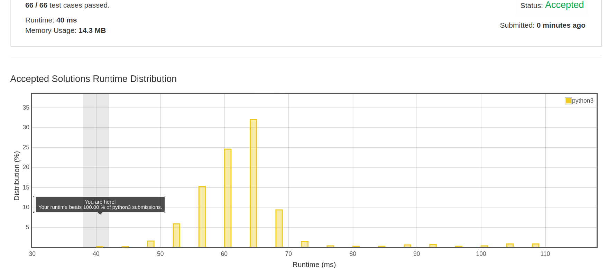

# [Check If It Is a Straight Line](https://leetcode.com/problems/check-if-it-is-a-straight-line/)
[Challenge card](https://leetcode.com/explore/challenge/card/may-leetcoding-challenge/535/week-2-may-8th-may-14th/3323/)

You are given an array coordinates, coordinates[i] = [x, y], where [x, y] represents the coordinate of a point. Check if these points make a straight line in the XY plane.

Example 1: 

Input: coordinates = [[1,2],[2,3],[3,4],[4,5],[5,6],[6,7]] 

Output: true 

Example 2: 

Input: coordinates = [[1,1],[2,2],[3,4],[4,5],[5,6],[7,7]]

Output: false
 
Constraints:

2 <= coordinates.length <= 1000
coordinates[i].length == 2
-10^4 <= coordinates[i][0], coordinates[i][1] <= 10^4
coordinates contains no duplicate point.

### Beat 100% of the Python3 solutions

